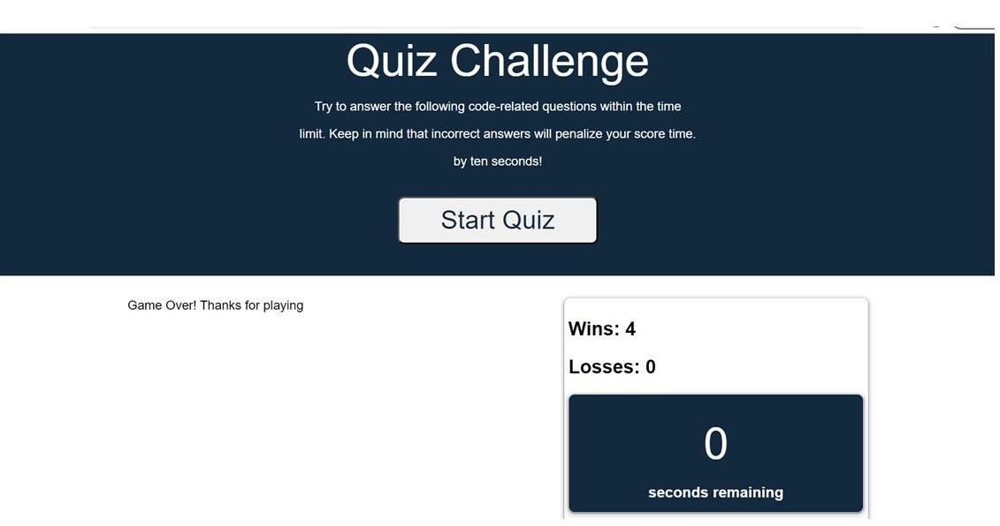

# timedquiz
Short Quiz for UT Coding Bootcamp Challenge 04

This program includes 5 files as follows:
index.html
readme.md
license
/assets/css/style.css
/assets/js/script.js
/assets/quizChallenge.jpg

The object of this project is use as much JavaScript code in order to accomplish this short quiz.
Here are some requirements to the project:
The user selects a start button for the quiz to begin.
A timer is set and begins a countdown once the quiz starts.
The user is presented with a bunch of questions and a multiple choice answer.
The user selects an answer by clicking on the answer and the answer is highlighted.
The user selects an incorrect answer, the user is penalized by deducting one second from the clock.
The next question is displayed until either the timer is out OR the user has answered all the questions.
If the timer is out OR the user has answered all the questions, a message of "Game over" is displayed.
The Scoreboard will display for each win or loss increment.

Git Hub repository url:
https://github.com/agentpj/timedquiz

Git Hub deployment url:

